#  🔵 Lab 01 - Wazuh SIEM Home Lab 

## Overview 


This lab was designed to simulate how a real-world cyberattack would unfold when vulnerabilities are present on endpoint. The overall goal was to understand how threat actors perform reconnaissance and brute force attacks and how SOC analyst monitors and detect those attacks through a security information and events management tool. Therefore by building this environment from scratch, I gained hands-on experience from both the offensive and defensive sides of a security incident.

---

## Environment 

The lab consisted of three virtual machines all simultaneously running on the same isolated network infrastructure within the Oracle VM Virtual Box. The three virtual machines were:


- Wazuh version 4.14.5 – The security information and events management system
- Windows 10 pro – The target/victim machine with the Wazuh agent deployed on and installed upon.
- Kali Linux 2026.1 – The attacker machine.


All three machines were connected via the NAT Network which I named SOC-Lab-01-Wazuh for familiarly sake within the subnet 10.0.2.0/24 provided automatically, which allowed them to all communicate with each other whilst remaining completely isolated from the real network.

| Machine | Role | IP Address |
|---------|------|------------|
| Wazuh v4.14.5 | SIEM Server | 10.0.2.10 |
| Windows 10 Pro | Target Machine | 10.0.2.5 |
| Kali Linux 2026.1 | Attacker Machine | 10.0.2.6 |


An important fact to note: 

The Wazuh SEIM server was given a static IP address rather than the standard DHCP which automatically assigns a random IP address which would have caused confusions and become problematic for us in the future, hence why I gave it a permanent IP address.

---

## Tools Used 


The primary tools used within the lab was the Wazuh OVA, deployed as the SIEM server and its agent on the target machine. Wazuh was the foundation and fundamental tool in this entire lab. It collected logs, detected threats and displayed alerts through its dashboard. Additionally, I also utilised Nmap scans for reconnaissance, by scanning the target machine in order to find open ports to exploit. After the scan I used Hydra in order to execute brute force attacks against the RDP service on the target machine via the Rockyou.txt wordlists. 


| Tool | Version | Purpose |
|------|---------|---------|
| Wazuh | v4.14.5 | SIEM — log collection, threat detection, alert dashboard |
| Nmap | v7.98 | Network reconnaissance — port and service scanning |
| Hydra | - | Brute force attack tool |
| Rockyou.txt | - | Password wordlist used with Hydra |
| VirtualBox | - | Virtualisation and network management |


---

## Lab Architecture

The kali Linux attacker machine situated at 10.0.2.6 launches attacks against the windows 10 target at 10.0.2.5 across an isolated NAT Network. The Wazuh agent deployed on the Windows 10 endpoint captures the resulting telemetry and forwards it to the Wazuh SIEM server at 10.0.2.10, which acts as the central nervous system of the lab. Following this, the Wazuh SIEM processes the incoming data and generates alerts which are then triaged, Thus filtering out the False positives to locate and identify the true positives that are critical. 

Below is a visualisation of the Lab topology: 

```
Kali Linux (10.0.2.6)
        ↓ attacks
Windows 10 (10.0.2.5)
        ↓ telemetry via Wazuh Agent
Wazuh Server (10.0.2.10)
        ↓
SOC Analyst Dashboard
```
---

## Phase 1- NAT Network Setup

In Phase 1, I began by interconnecting all three virtual machines via an isolated NAT Network named SOC-Lab-01-Wazuh on subnet 10.0.2.0/24. This network type was chosen as it was imperative to host the machines on a network that allows isolation from the real network whilst still allowing communication between the VMs themselves. Given that the lab involved a dangerous attacker machine such as Kali Linux, isolating the environment was a critical security consideration. NAT Network fit this requirement perfectly.

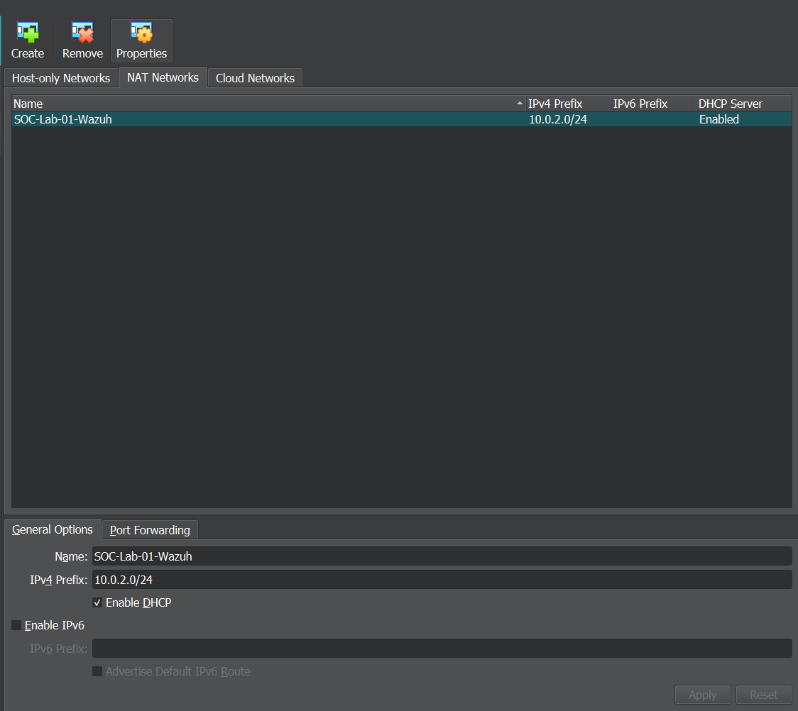

---

## Phase 2- Wazuh Server Deployment

in Phase 2, I imported the first of three virtual machines in the Oracle VM VirtualBox, The essence of this home lab, the Wazuh SIEM Server. Once deployed and connected to the NAT Network named SOC-Lab-01-Wazuh, I then assigned it a static IP address of 10.0.2.10 rather than its default DHCP setting to ensure the Wazuh agents on the endpoint machine can respond back to the Wazuh server with the telemetry findings.

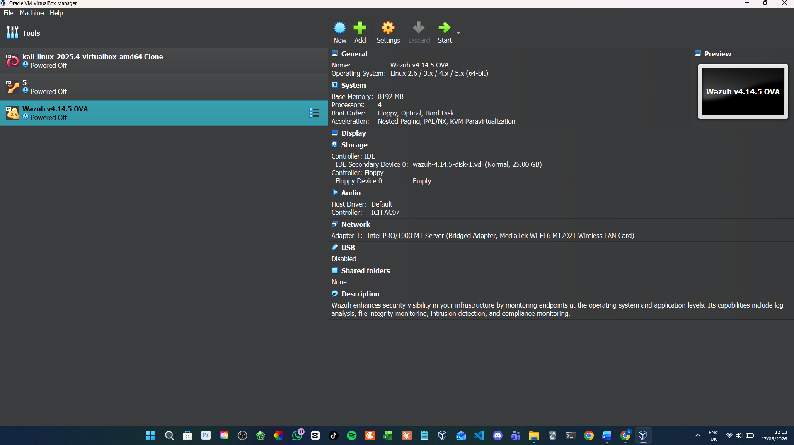
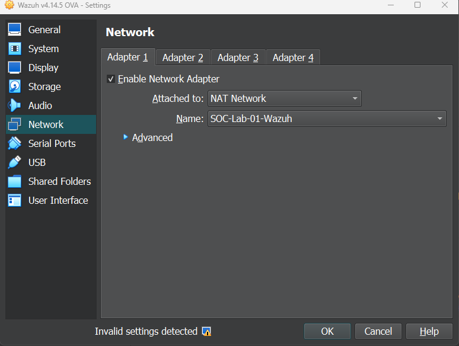

---

## Phase 3- Kali Linux Setup

In phase 3, once extracted the Kali Linux folder, I then imported the Kali Linux VM onto the Oracle VM VirtualBox. Its imperative to note that I also configured this Virtual Machine to the NAT Network SOC-Lab-01-Wazuh as it is also one of the machines that needed to be deployed to make this home lab work. A little fact to note, I didn't assign a static IP address to this Virtual Machine as it's the attacker machine and doesn't need a fixed address as only the Wazuh server required one so its agents could always find it

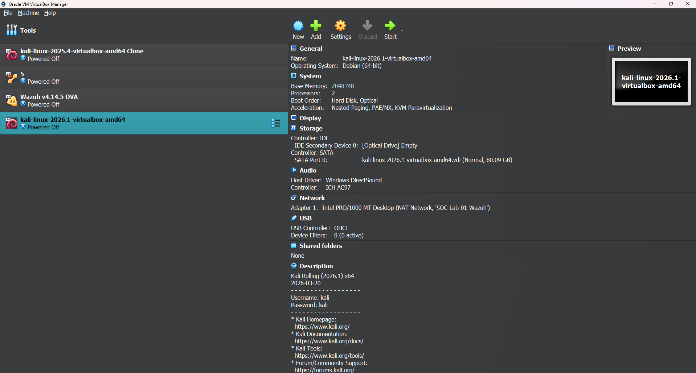
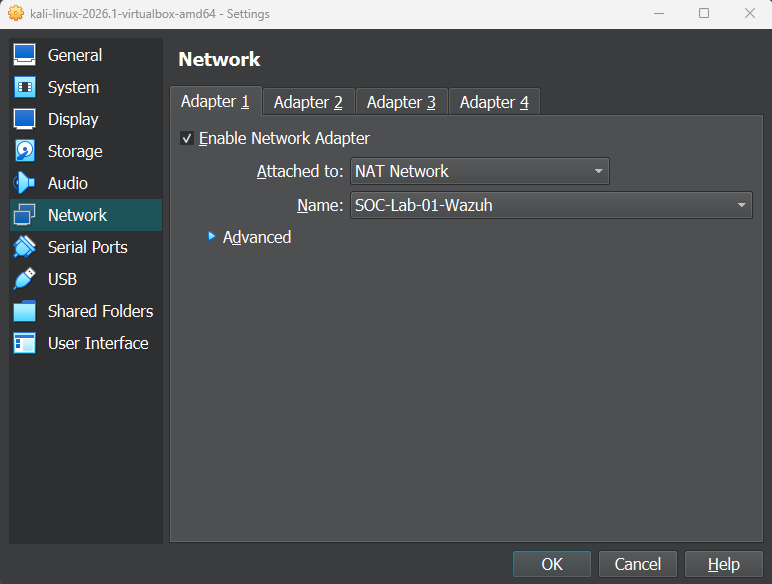

---

## Phase 4 - Windows 10 Target Setup

Phase 4 showcases the integration of deploying the recently installed Windows 10 ISO image into my file explorer and then importing it into the Oracle VM Virtualbox. Just like the previous virtual machines, this endpoint machine was interconnected with the others via the NAT Network type named SOC-Lab-01-Wazuh. The Windows 10 target setup is extremely crucial as it will be serving as the point were the Wazuh agents will collect telemetry and report back to the Wazuh server, all visible on the dashboard.


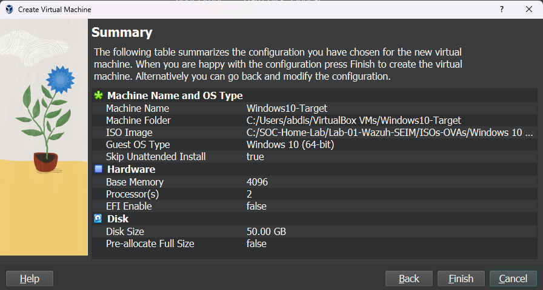
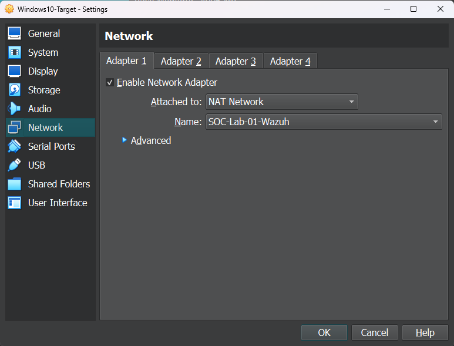
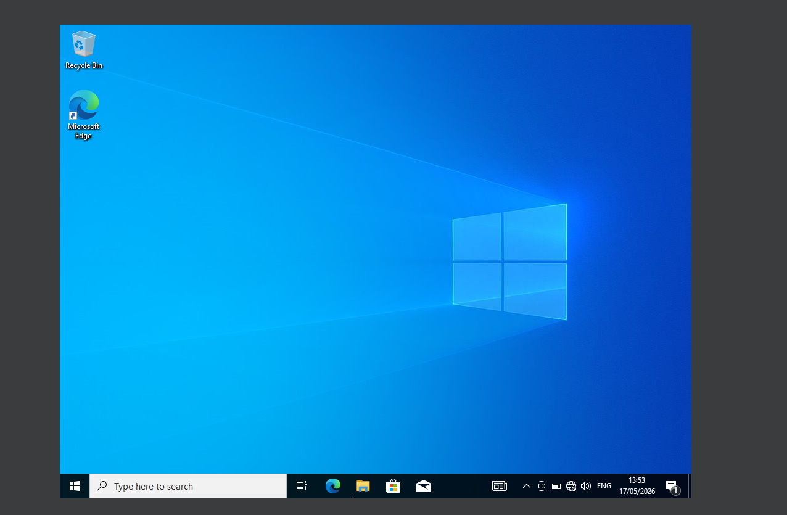
---

## Phase 5 - All VMs Ready

Phase 5 confirmed that all three virtual machines were running simultaneously and successfully connected on the same isolated NAT Network infrastructure. Having no obstacles at this was vital, it showcased that the lab infrastructure was correctly configured and ready for the proceeding phase. With the Wazuh server, Windows 10 target machine and Kali Linux attacker all operational and communicating with each other, the environment was fully prepared for attack simulation and threat detection.

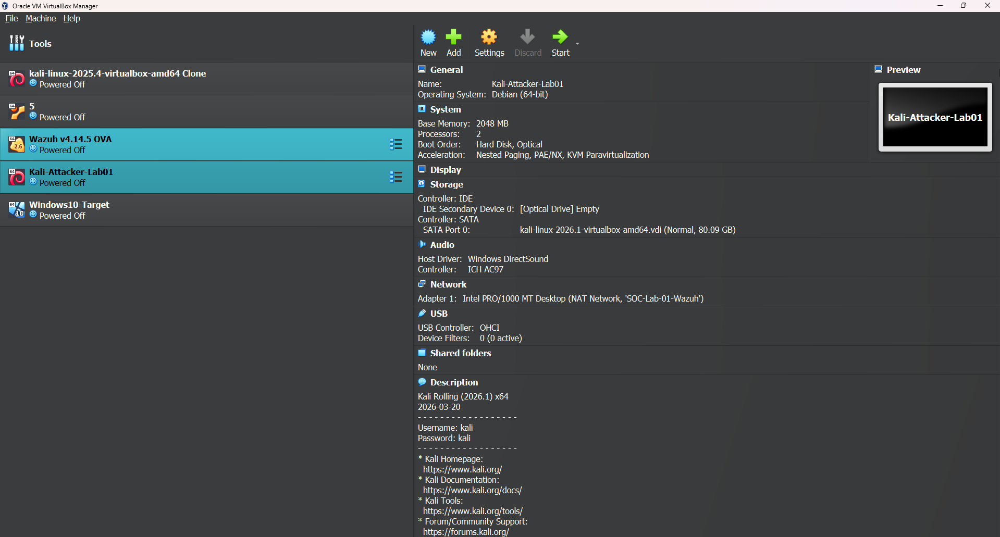

---

## Phase 6 - Wazuh Dashboard Access & Agent Deployment

Phase 6 brought the SOC lab to life. The Wazuh server was first assigned a static IP address of 10.0.2.10, ensuring the endpoint agent would always have a fixed address to report to. The Wazuh dashboard was then accessed at https://10.0.2.10, made possible by all three virtual machines being interconnected on the same NAT Network infrastructure. The Wazuh agent was deployed on the Windows 10 target machine using the MSI installer, establishing a direct communication path between the endpoint and the Wazuh server. Once installed and configured with the Manager IP set to 10.0.2.10, the agent began forwarding raw telemetry from the endpoint back to the Wazuh server. The Windows 10 machine appeared as active in the dashboard, confirming the agent was successfully reporting. The lab was now fully operational and ready for attack simulation.

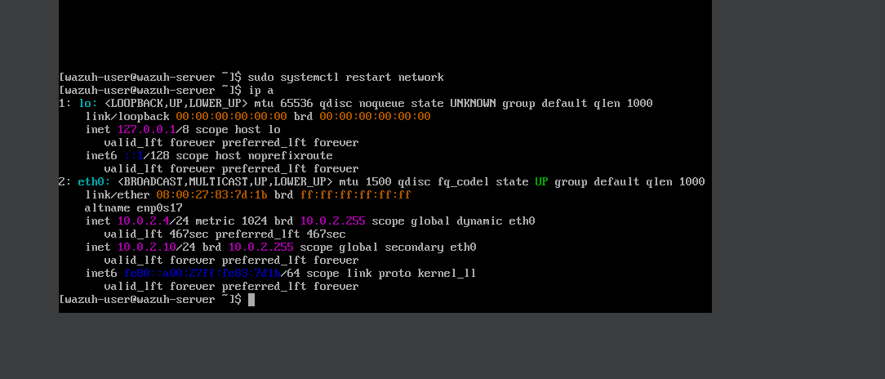
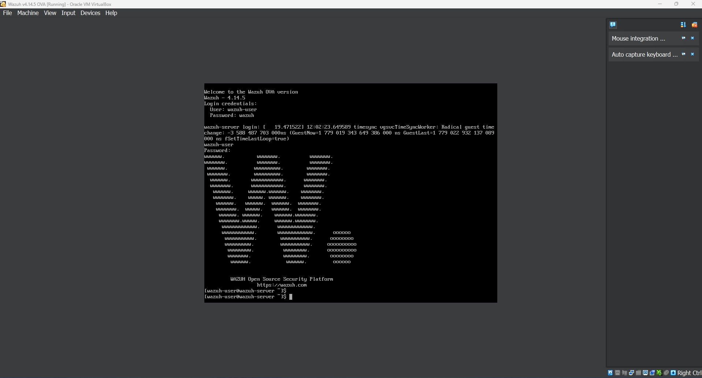
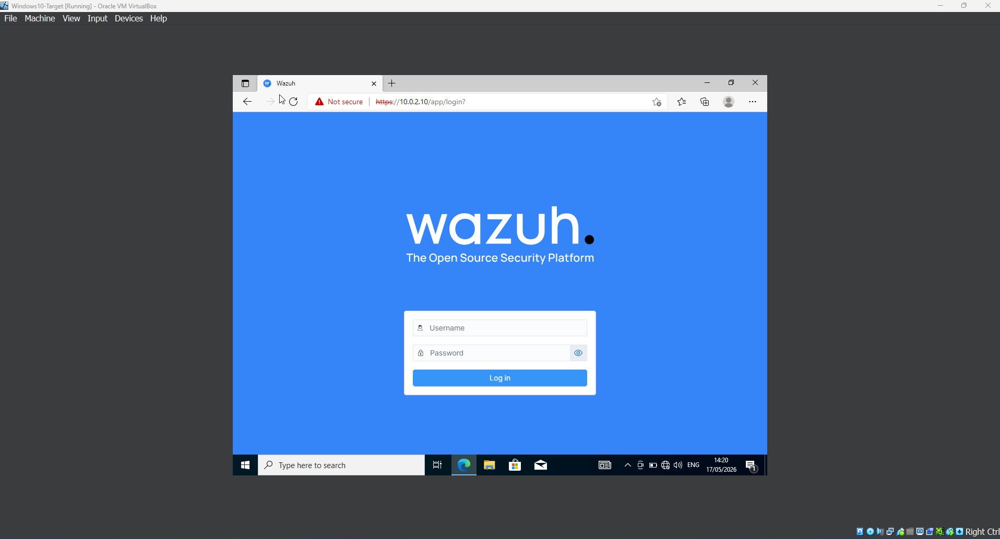
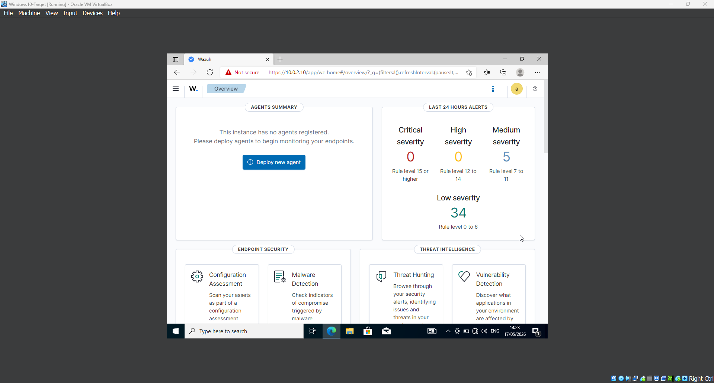
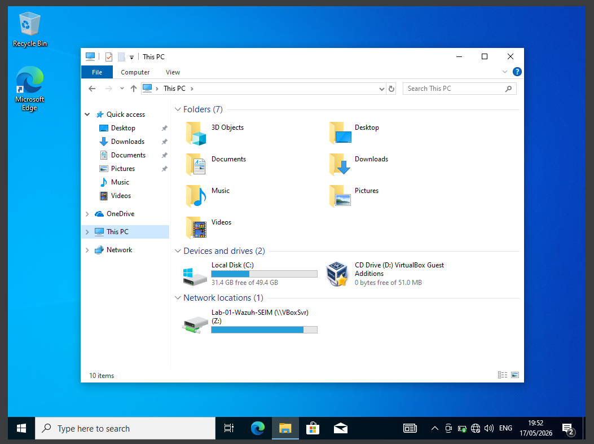
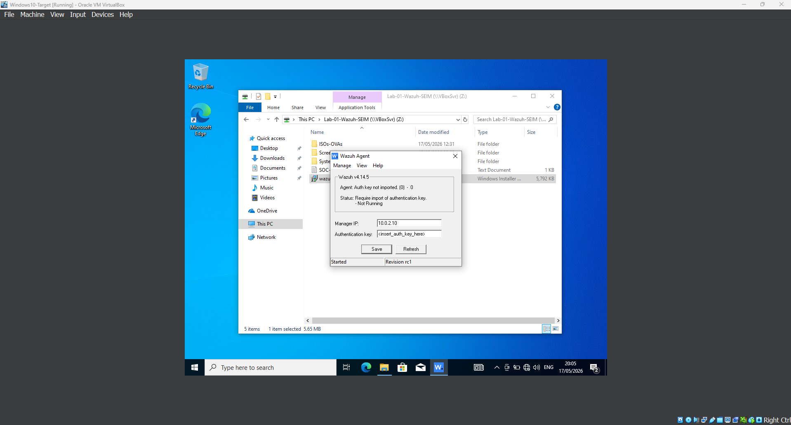
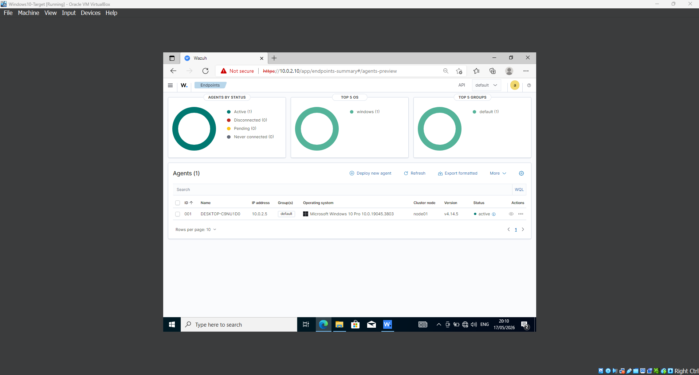


---

## Phase 7 - Attack Simulation

## Attack 1 - Nmap Network Reconnaissance

In Attack 1, reconnaissance was performed against the target machine using Nmap. The command used was nmap -sV 10.0.2.5, scanning the Windows 10 target for open ports and running services. The scan revealed four open ports — 135 (RPC), 139 (NetBIOS), 445 (SMB) and 3389 (RDP). Windows Firewall was disabled on the target machine to simulate a misconfigured endpoint, a common finding in real world environments. RDP on port 3389 was selected as the target for the brute force attack as it is one of the most commonly exploited services in real world attacks, allowing remote access to a machine if credentials are successfully compromised

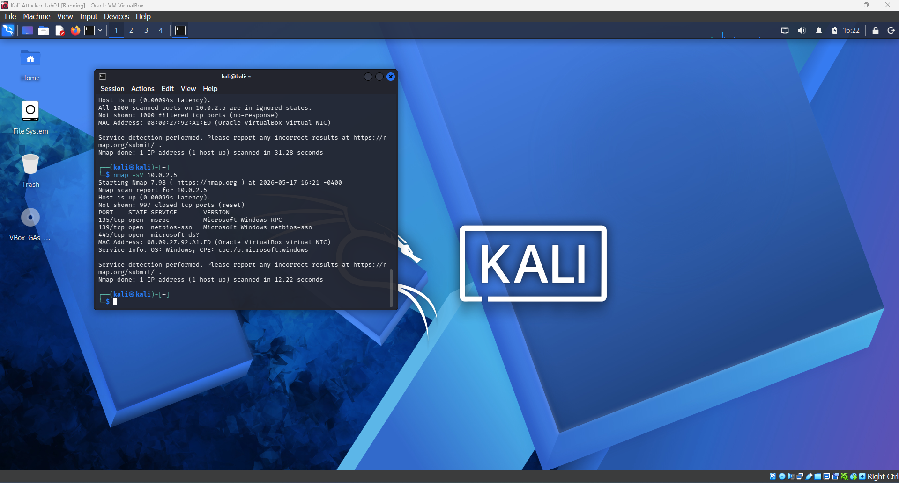
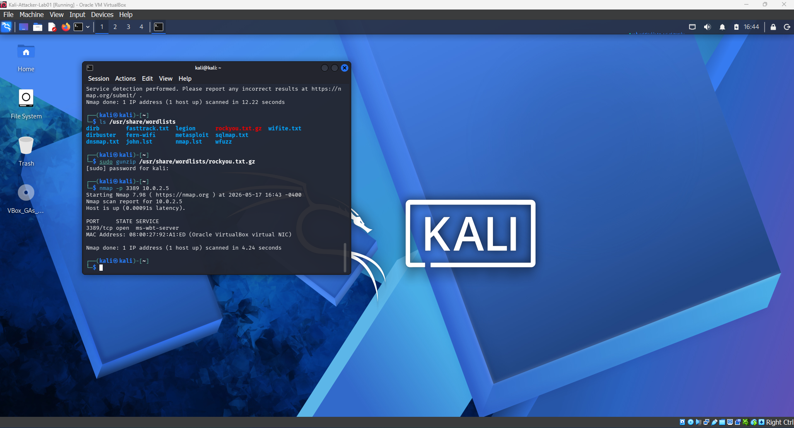


## Attack 2 - Hypdra RDP Brute Force

In Attack 2, with RDP identified as an open port on port 3389, a brute force attack was launched against the RDP service using Hydra, a widely used automated login attack tool. Hydra was fired against the target using the command "hydra -l LabUser -P /usr/share/wordlists/rockyou.txt rdp://10.0.2.5 -t 4 -V". The Rockyou.txt wordlist contains over 14 million real world passwords leaked from previous data breaches. Hydra fired repeated login attempts against the target machine, generating multiple authentication failures before being blocked by Windows connection limiting. Despite not successfully authenticating, the attack generated significant log activity which simulated a real world brute force scenario and also tested Wazuh's detection capabilities.


---

## Phase 8 - Alert Analysis

Phase 8 showcases the true power of the SOC Lab. The Wazuh agents collected the resulting telemetry from both attacks and forwarded it to the Wazuh dashboard for analysis. Across the full day, 482 total security events were generated, however this doesnt mean all of these events were malicious or exploitations. A significant portion of these events were normal Windows system events such as service startups and policy changes. This highlights the core SOC analyst skill, triaging several hundred events to identify the critical ones, or the ones of importance. Of the 482 events, 14 were
authentication failures and 0 successful authentications recorded directly corresponding to the Hydra brute force exploit we ran against the target machine. The Wazuh dashboard also mapped the detected activity to the MITRE ATT&CK framework, identifying Credential Access and Defense Evasion as the top tactics.

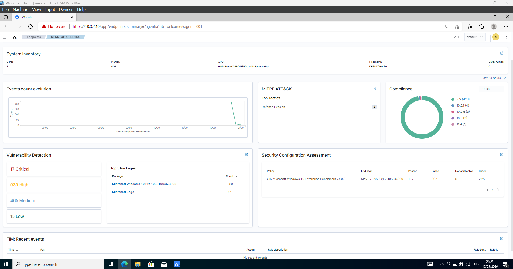
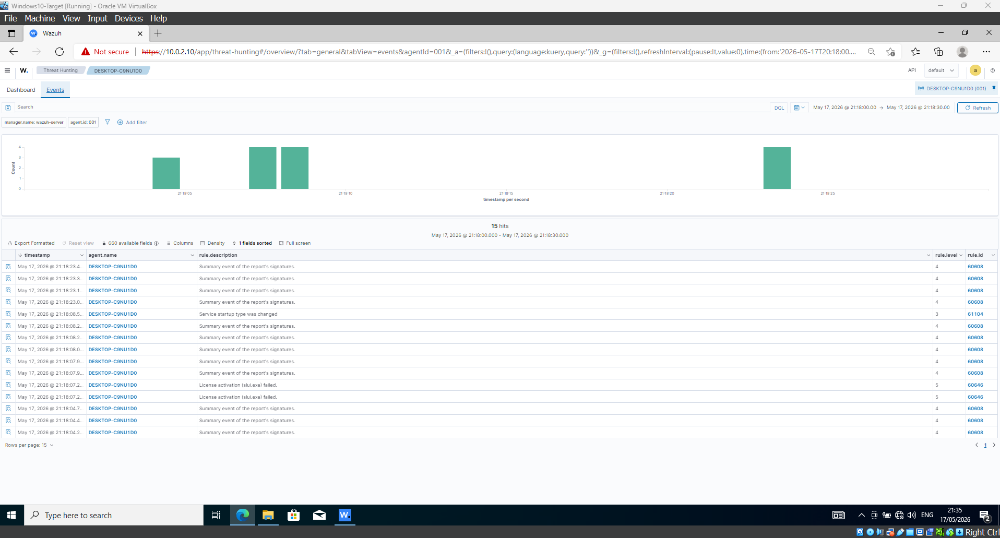
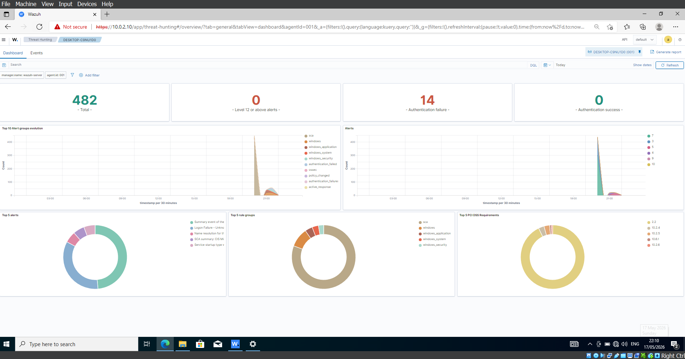
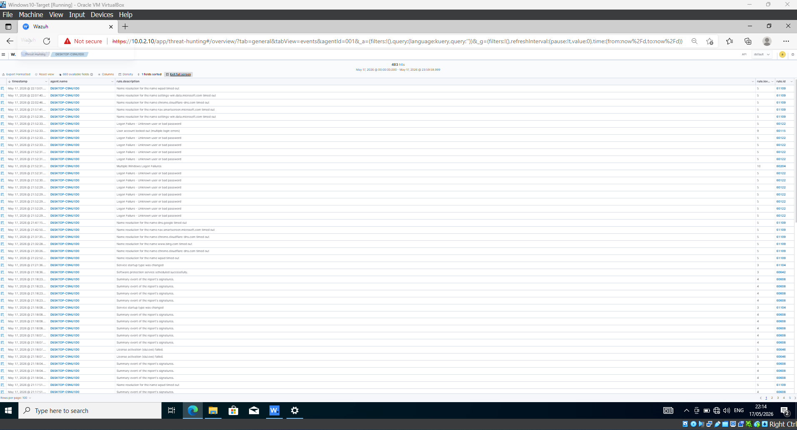
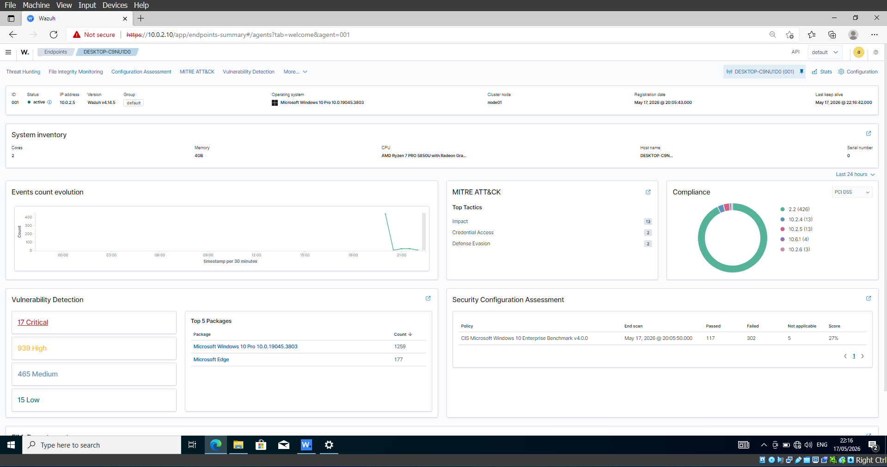

---

## Analysis & Findings

This lab demonstrated how quickly a real world attack can unfold and how a SIEM detects it. The Nmap scan performed the reconnaissance stage, successfully identifying four open ports on the target machine, 135, 139, 445 and 3389, exposing the attack surface to the adversary. The attack vector chosen was Hydra, a brute force tool that fires passwords from the Rockyou.txt wordlist containing over 14 million real world leaked passwords, targeting the RDP service on port 3389. This generated 14 authentication failure events, all of which were successfully detected and logged by the Wazuh SIEM. Of the 482 total events recorded throughout the lab, the majority were normal Windows system events which demonstrated the importance of triage in identifying the 14 critical authentication failures amongst the noise. The MITRE ATT&CK framework correctly classified the attacks under Credential Access and Defense Evasion, confirming Wazuh's ability to map real world attack techniques to a recognised threat intelligence framework.

---

## Recommended SOC Response

In a real SOC environment, the recommended Tier 1 response to these alerts would begin with triaging the 482 total events to separate the normal Windows system activity from the 14 critical authentication failures. Once identified, the source IP of the attack at 10.0.2.6 would be cross referenced against known threat intelligence sources to determine whether it is a recognised malicious actor. The analyst would then verify whether any of the authentication attempts were successful. If so, immediate containment of the affected endpoint at 10.0.2.5 would be required to prevent any lateral movement across the network. The incident would then be escalated to a Tier 2 analyst with a full handoff including the timeline, source IP, affected machine, attack type and all relevant indicators of compromise. Recommended remediation steps would include blocking the source IP at the firewall level, re-enabling Windows Firewall on the endpoint, implementing an account lockout policy after a set number of failed login attempts and disabling RDP if it is not operationally required. A formal incident report would be produced documenting all findings, actions taken and recommendations to prevent recurrence.


---

## Lessons Learned

This lab provided several key lessons and takeaways.
* **Attack Surface Reduction:** Adversaries exploit all available attack surfaces. Closing unnecessary open ports and disabling unused services is critical to reducing exposure.
* **Visibility of Failed Attempts:** A failed attack still generates detectable evidence. The Hydra brute force never authenticated successfully, yet Wazuh still captured and surfaced every attempt.
* **Alert Triage Efficiency:** SOC analysts face hundreds of alerts daily. Effective triage is what separates noise from genuine threats, demonstrated by identifying 14 critical alerts amongst 482 total events.
* **Future Telemetry Enhancements:** Future iterations of this lab will incorporate Sysmon to enrich endpoint telemetry, providing deeper visibility into process-level and network activity.
